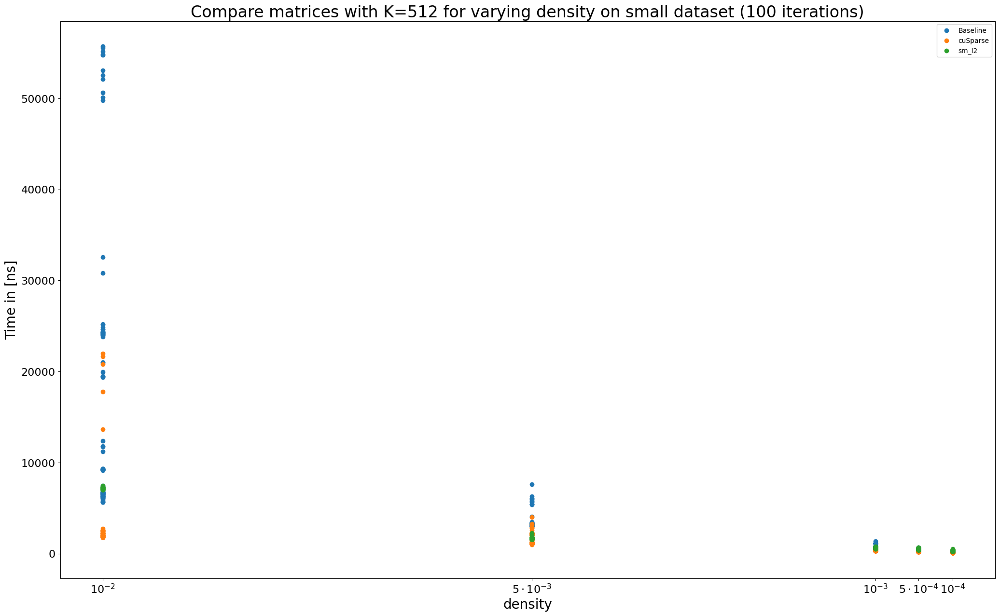
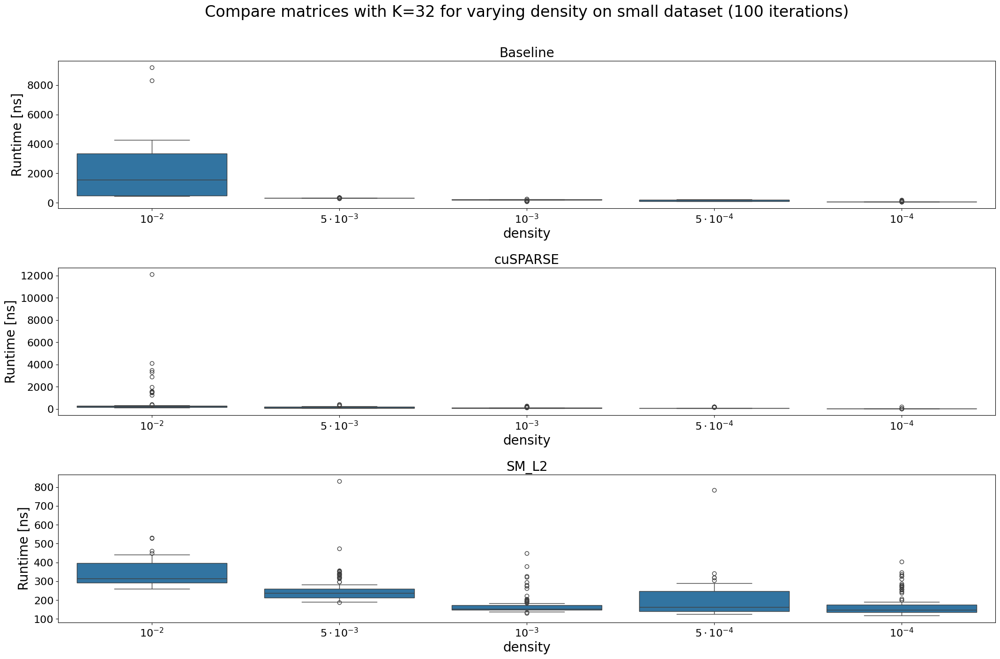
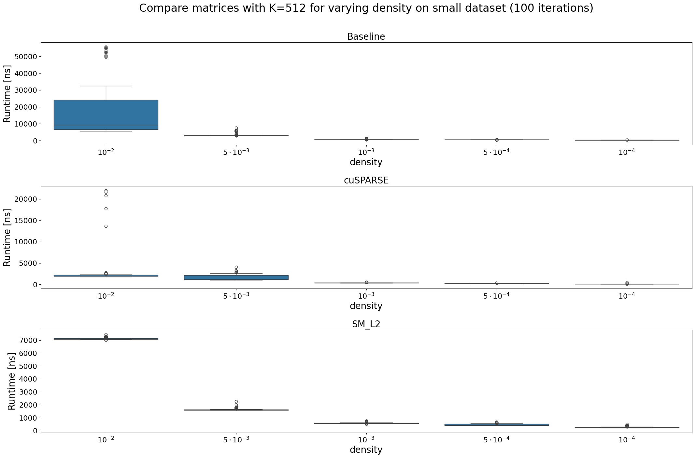
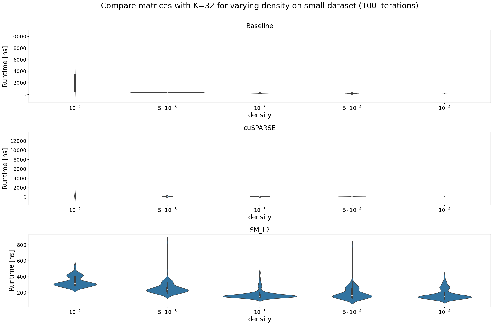
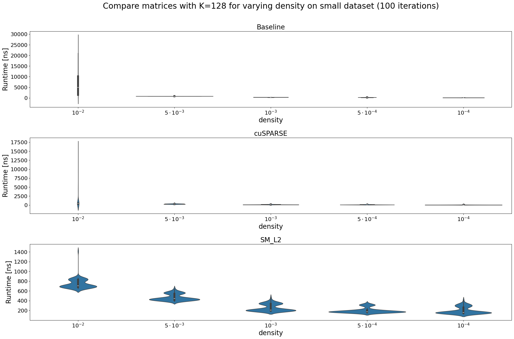
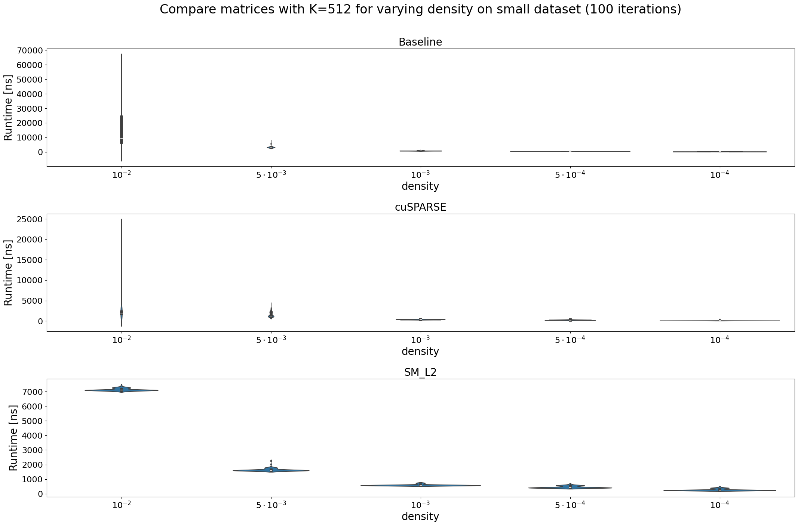
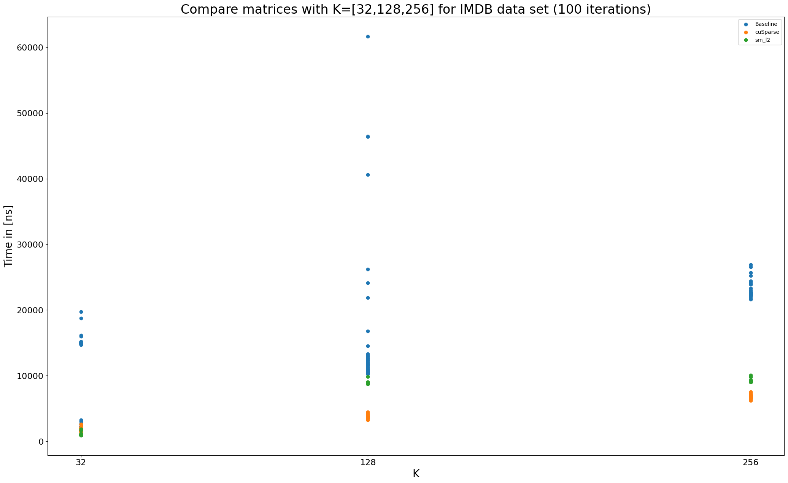
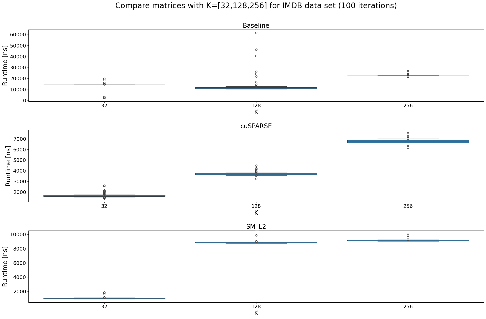
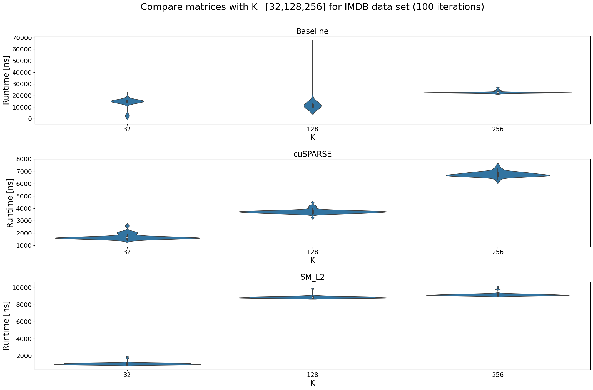

# SDDMM Benchmarking of SM-L2 algorithm vs a naive version and cuSPARSE

## About this work
In this work, we present a performance comparison of three GPU-based SDDMM algorithms for handling very sparse matrices: a straightforward naive implementation, the SM-L2 algorithm featuring tiling and other advanced techniques and NVIDIA’s cuSPARSE. To enable and aid in benchmarking, we developed a suite of tools for creating, storing and visualising matrices. We employ a diverse range of benchmarks, leveraging both synthetically generated matrices and real-world matrices from the SuiteSparse Matrix collection by the University of Florida. The matrices varied in size and distribution, including very large, non-uniformly distributed matrices, offering a robust benchmarking foundation for our evaluations. Additionally, we present the results of profiling the SM L2 algorithm that identify performance bottlenecks and suggest potential areas for improvement.

The uniformly distributed, large, sparse matrices are generated with a generator described later on. The non-uniformly distributed large, sparse matrices are downloaded from https://sparse.tamu.edu/Pajek?filterrific%5Bsorted_by%5D=rows_asc. All used matrices can be dowloaded from page 4 of this website.


Following is a concise description on how to compile and run the code as well as a listing of all produced benchmarks and the resulting plots.

## Setup
The benchmarking framework is set up to work on Windows 11, Visual Studio Community Edition 2022, CMake and C++20 standard. It probably also works on Linux since GCC compiler tends to be more forgiving in terms of obeying to C++ specifications. Note, that if you run this on Linux, you have to double-check that the paths always use the correct kind of path separators.

## Steps to reproduce
1. Install Nvidia CUDA framework (https://developer.nvidia.com/cuda-downloads)
2. Open the repository in Visual Studio and run CMake config
3. If CMake config ends with an error, add the .cuda_arch file with the correct CUDA architecture as indicated in the CMake config output. Make sure, that there is NO newline after the architecture number and run the CMake config again
4. Build all exes in Visual Studio (make sure it's set to release mode)
5. Open ./sddmm_data/init.py and run it. This will copy the folder structure to create the benchmark data onto C drive (Note: if you use Linux, you have to change everything to a Linux folder structure :-D ) and copy all relevant exe files into C:/sddmm_data as well.
6. Open the folder C:/sddmm_data/data_sets where you will see IMDB, patents and patents_main subfolders. Inside each of those folders is a readme.txt describing how to download and unpack the data for the existing large sparse matrices. At the end of this step, each one of the mm_market subfolders should directly contain the martix market data files.
7. Run create_data_sets.bat, create_sparsity_large_2.bat and create_sparsity_small.bat indivisually inside cmd or Powershell to create all the test data. At the end of this step, each one of the subfolders inside data_sets and inside sparsity_large_2 and sparsity_small there should be a number of .binmat files that each contain two dense and one sparse matrix.
8. (This step is optional) Run generate_all_images.bat. This will create distribution images of all the generated, large sparse matrices. The images are on a scale from blue to red, where blue indicates the lowest and red the highest probability to encounter a nonzero value. The images have the same name as their respective .binmat file and are located in the same folder as well. Below are some samples of how the distributions look like.

   Low sparsity uniform matrix                               |  High sparsity uniform matrix
   :--------------------------------------------------------:|:----------------------------------------------------------:|
     |  
   
   IMDB                         |  patents                         |  patents_main
   :---------------------------:|:---------------------------------|:------------------------------------:|
     |    |  

10.  Run run_all_benchmarks.bat. This will run all the benchmark tests and generate in each one of the folders that contain .binmat files corresponding .txt files with the results. Each txt file belongs to a sequence of experiments and by itself will generate one data point in the output plots. One results data file looks as follows:
```
    [INFO]
    experiment_name imdb
    variable K
    N 428440
    M 896308
    K 32
    sparsity 0.99999
    description Compare matrices with K=[32,128,256] for IMDB data set
    runtime 22
    n_warmup_iterations 5
    sequence_number 1
    [/INFO]
    [DATA]
    [L] Baseline
    [D] 2313 2327 2345 2330 2296 2286 2314 2926 2294 2961 14949 14946 16505 14781 15012 15061 14919 16717 14861 14692 15015 14732 14975 14836 14908 14958 14748 17525 14655 16485
    [L] cuSPARSE
    [D] 1677 1868 1939 1882 1888 1902 1554 2015 1543 2058 1614 1439 1583 1585 1568 1611 1582 1541 1595 1485 1573 1532 1478 1805 1460 1526 1910 1404 1554 1581
    [L] sm_l2
    [D] 1166 1021 1159 1138 1159 1158 1239 1169 1028 1180 1039 1168 1158 1273 1161 1180 1171 1138 1033 1025 1026 1162 1170 1161 1153 1178 1027 1159 1162 1153
    [/DATA]
```
 * The **[INFO]** section contains all information on how the test was generated.
   * **experiment_name** is the overall name of the benchmarking experiment
   * **variable** field contains the name of the variable that was varied in the benchmark. In this case this was the inner dimension K. 
   * **N, M, K** which are the dimensions of the matrices where dense A and B matrices are in NxK and KxM respetively and sparse matrix S is in NxM. 
   * **sparsity** indicates in this case that 99.999% of all entries in the sparse matrix are zero. 
   * **description** outlines the benchmark.
   * **runtime** indicates the runtime of this particular data point, meaning how long in *seconds* it took to run all algorithms in the benchmark with this particular data for x amount of times (wher x == length(one of the arrays with the numbers below))
   * **n_warmup_iterations** indicates how many times the data point was run without recording the data
   * **sequence_numner** indicates the place this data file has inside the entire benchmark run with multiple data points. In this case, this is the first results file.
 * The **[DATA]** section contains all the time measurements
   * each measurement consists of an L and a D part where the L contains the name of the algorithm and D the the time measurements for all the test runs
   * In this case, there were three algorithms 'Baseline', 'cuSPARSE' and 'sm_l2' and all of them were run 30 times with the same input data

11. Copy all the results files (all desired .txt files from all data subfolders) into ./results/analysis/[some_expressive_folder_name]. ./results/analysis contains two Python scripts data.py and plots.py. Open plots.py and at the bottom call the plot(..) function with the correct path to your result files. The following evaluation plots will be generated.

   Plot 1                                       |  Plot 2                                       
   :-------------------------------------------:|:---------------------------------------------:|
     |    |

   Plot 3                                       | Plot 4
   :-------------------------------------------:|:---------------------------------------------:|
     |   


## cuSPARSE
The documentation for cuSPARSE can be found here: https://docs.nvidia.com/cuda/cusparse/index.html. More importantly, useful examples can be found here: https://github.com/NVIDIA/CUDALibrarySamples/tree/master/cuSPARSE.

## cuRAND
We use cuRAND to generate large scale sparse matrices. The official documentation can be found here: https://docs.nvidia.com/cuda/curand/index.html, some useful examples can be found here https://github.com/NVIDIA/CUDALibrarySamples/tree/master/cuRAND.

## Walktrough of exe files
Designations: one SDDMM product is $(A \bullet B) \odot S$ where $A \in N \times K$, $B \in K \times M$ and $S \in N \times M$, A and B are dense and S is a sparse matrix. K is the inner dimension of A and B, N is the outer dimension of A and M is the outer dimension of B.

The **sparsity** refers to the percentage of zeros in the sparse matrix. If sparsity=0 the sparse matrix S will contain 0 non zero values (at least no zeros will be generated on purpose). If sparsity=1.0, all values of S will be zero. So with sparsity=0.99, 99% of the values in the sparse matrix are zero and 1% are non zero.

The **output** of all the generators is a file with a .binmat extension. That is a custom made, binary dump. Loading a binary dump is much faster than generating huge matrices.

**NOTE:** everytime a parameter is a path that points to a folder and not a file, the path **must** end with a valid path separator (windows has \, Linux has /)!

**NOTE:** this framework was created and tested on Windows. If someone runs it on Linux, better double check that all paths are correct. That will generally be the case, if nothing crashes ^^.

## Data Generators
### data_gen.exe
This exe can be used to generate two dense matrices A and B and a sparse matrix S by passing the inner dimension K, the sparsity of S and the required size in bytes for A and B. The goal is to generate matrices that are as large as possible in order to do useful benchmarking. The parameters are given as follows. The parameter K_row generally has the same meaning as K. The goal is to compare SDDMM between matrices with inner dimension K=32, K=128 and K=512. However, outer dimensions N and M should stay the same. But we only pass K and the sizes of A and B in bytes. This is where K_row comes in. We use K=512 for all three SDDMM data generations and get three times the same N and M but varying K. 

If the user wants to generate A, B and S with given sizes in bytes for A and B, the exe will first show how large the matrices will be and ask the user to proceed or not. Since we like to be able to run batch generations without interruptions we need a parameter to skip that question. This is the last parameter that can take the values of either skip=true or skip=false, written exactly like that, no spaces! There is a string.compare(..) in there to check.

```
.\data_gen.exe [path to target folder] [K] [sizeof A in bytes] [sizeof B in bytes] [sparsity] [K_row] [skip=true|skip=false]
```

#### Example
```
.\data_gen.exe "C://sddmm_data/sparsity_large_2/K512/" 512 210000000 210000000 0.99 512 skip=true
```

### data_gen_mat_market.exe
This exe can be used to generate two dense matrices A and B for an existing sparse matrix S. The matrix S has to be in matrix market format (http://math.nist.gov/MatrixMarket), thus it has a file ending .mtx. The last parameter is the inner dimension of A and B.
```
.\data_gen_mat_market.exe [path to target folder] [path to mtx file] [K]
```

#### Example
```
.\data_gen_mat_market.exe "C:/sddmm_data/data_sets/patents/" "C:/sddmm_data/data_sets/patents/mm_market/patents.mtx" 32
```

### data_gen_mat_market_companion.exe
This exe can be used to generate a uniformly distributed, sparse companion matrix to an existing non-uniformly distributed sparse matrix. The parameters are the path to the target folder, the inner dimension for the generated dense A and B, outer dimensions N and M that should match the dimensions of the existing sparse matrix, and the sparsity that should also match the sparsity of the existing sparse matrix. Finally there is the skipping parameter that hast to be either skip=true or skip=false that lets the user skip the intermediate check if the sizes of the matrices that will be generated are ok.

```
.\data_gen_mat_market_companion.exe [path to target folder] [K] [N] [M] [sparsity] [skip=true|skip=false]
```

#### Example
```
.\data_gen_mat_market_companion.exe "C:/sddmm_data/data_sets/patents_companion/" 32 3774768 3774768 0.9999989493 skip=true
```

## Image Generator
### create_img.exe
This exe takes a .binmat file as input and generates an image of the distribution of the sparse matrix as showcased further up in the _Steps to reproduce_ section. It takes the path to a folder that contains the .binmat file and an integer that will be the **height** of the generated image. The **width** is calculated using the given height to match the aspect ratio of the sparse matrix. An image will be generated for all the .binmat files inside the given folder.

```
.\create_img.exe [path to folder with .binmat files] [height of generated image]
```

#### Example
```
.\create_img.exe "C://sddmm_data/data_sets/patents_main_companion/" 512
```

## Benchmarking
### GPU_SDDMMBenchmarks.exe
This exe runs all the benchmarks (12 in total). The benchmarks are numbered between 1 and 12, thus the only parameter this exe takes is an integer between 1 and 12.
```
.\GPU_SDDMMBenchmarks.exe [benchmark num]
```

#### Example
```
.\GPU_SDDMMBenchmarks.exe 12
```

#### Listing of the different benchmarks
1. **Compare matrices with K=32 for varying sparsity on large dataset**
   <br>(run all algos on sddmm_data/sparsity_large_2/K32)
3. **Compare matrices with K=128 for varying sparsity on large dataset**
   <br>(run all algos on sddmm_data/sparsity_large_2/K128)
5. **Compare matrices with K=512 for varying sparsity on large dataset**
   <br>(run all algos on sddmm_data/sparsity_large_2/K512)
7. **Compare matrices with K=32 for varying sparsity on small dataset**
   <br>(run all algos on sddmm_data/sparsity_small/K32)
9. **Compare matrices with K=128 for varying sparsity on small dataset**
    <br>(run all algos on sddmm_data/sparsity_small/K128)
11. **Compare matrices with K=512 for varying sparsity on small dataset**
    <br>(run all algos on sddmm_data/sparsity_small/K512)
13. **Compare matrices with K=[32,128,256] for IMDB data set**
    <br>(run all algos on sddmm_data/IMDB)
15. **Compare matrices with K=[32,128,256] for IMDB companion**
    <br>(run all algos on sddmm_data/IMDB_companion)
17. **Compare matrices with K=[32,128,256] for patents_main data set**
    <br>(run all algos on sddmm_data/patents_main)
19. **Compare matrices with K=[32,128,256] for patents_main companion**
    <br>(run all algos on sddmm_data/patents_main_companion)
21. **Compare matrices with K=[32,128,256] for patents data set**
    <br>(run all algos on sddmm_data/patents)
23. **Compare matrices with K=[32,128,256] for patents companion**
    <br>(run all algos on sddmm_data/patents_companion)

## Tests
All of the following exes contain tests.
* cuda_example_tests.exe
* cuda_tests.exe
* file_storage_tests.exe
* huge_file_mm_market_test.exe
* huge_file_tests.exe
* random_tests.exe
* sml2_tests.exe
* statistics_test_data.exe
* test1.exe

## All Benchmarking result plots

### Experiment 1

Vary non-zero density ($10^{−3}$, $5^{−3}$, $10^{−4}$, $5^{−4}$, $10^{−5}$), $A \in \{N \times K\}$, $B \in \{K \times M\}$ and $S \in \{N \times M\}$ for two different sizes N1 = M1 = 102539 and N2 = M2 = 10253. The experiment was repeated for inner dimension $K \in \{32, 128, 512\}$.


K=32, N1=M1=102539                                     |  K=128, N1=M1=102539                                    |  K=512, N1=M1=102539
:----------------------------------------------------:|:-------------------------------------------------------|:----------------------------------------------------:|
  |    |  
      |    |  
  |    |  

K=32, N2=M2=10253                                     |  K=128, N2=M2=10253                                    |  K=512, N2=M2=10253
:----------------------------------------------------:|:-------------------------------------------------------|:----------------------------------------------------:|
  |    |  
  |    |  
  |    |  

### Experiment 2

Vary the distribution using three different, existing sparse matrices IMDB, patents main and patents (their distributions are shown in the _Steps to reproduce_ section and concise descriptions of the matrices themselves are given on ). The experiment was repeated for inner dimension $K \in \{32, 128, 256\}$.


IMDB, K=[32, 128, 256]                  |  K=[32, 128, 256]                    |  K=[32, 128, 256]
:--------------------------------------:|:-------------------------------------|:---------------------------------------:|
  |    |  

### Experiment 3

Compare each algorithm between the non-uniformly distributed, sparse matrices IMDB, patents main and patents to uniformly distributed companion matrices with the same dimensions N and M . The experiment was repeated for inner dimension $K \in \{32, 128, 256\}$.The plot can be reproduced by running the script **./analysis/my_plots.py** from inside the folder _./analysis_.


## How to extend the benchmarks
Check out src/GPU_SDDMMBenchmarks.cpp. It is easy to just add more benchmarks in that file and recompile the project. Adding a new cpp file with a new structure requires adding the new executable in CMakeLists.txt as well. Anyone of the existing executables can serve as template. Watch out with linking Cuda::cudart and CUDA::cuda_driver if another library containing CUDA code is already linked. This is especially valid on Windows using the Visual Studio compiler that is much more sensitive with things like linking the same file or library multiple times. On Linux using GCC these things don't that much. Note that each subfolder that contains more than just .h files (as in .cpp files as well) requires a CMakeLists.txt file on it's own. Check out for example src/data_structures on how to do that. Each subfolder that creates a separate library needs an add_subdirectory statment in the toplevel CMakeLists.txt. 

Don't forget to add 
<br>set_property(TARGET [exe_name_placeholder] PROPERTY CUDA_ARCHITECTURES ${CUDA_ARCH}) 
<br>and 
<br>set_property(TARGET [exe_name_placeholder] PROPERTY CXX_STANDARD 20). 

Forgetting the first one may lead to the CUDA compiler compiling the CUDA code for a different platform version which can impact performance or make it just not work at all. Forgetting the second one may lead to trouble while compiling the C++ code, depending on which compiler is used. GCC is more lenient here too compared to the Visual Studio compiler. 

## How to run and compile the code with VSCode

This part may be helpful to run the code on Linux.

### Information for vscode and cmake
https://code.visualstudio.com/docs/cpp/cmake-linux

### How to set build folders debug/release for builds
* got vscode extension installation page
* select CMake Tools
* find **settings** cog-wheel next to installation buttions
* at option **Build Directory** set value to ${workspaceFolder}/build/${buildType}

### VSCode + CMake
* pres ctrl+p
* type "CMake:" in the search bar that shows up
* Relevant are
    * CMake: build, CMake: clean, CMake: Delete Cache and Reconfigure
* Deleting the "build" folder will cause CMake to have to rebuild everything
* In the first build run, matplotplusplus and all listed targets have to be built
* In subsequent build runs, only the missing stuff will be built
* Note, that the switch for Debug/Release mode is at the **bottom** of VSCode in a tiny box named "CMake: [Debug/Release]: Ready" XD

### Expected results
There should be a build folder containing either Debug, Release or both containing all executables that are listed as targets inside the toplevel CMakeLists.txt

